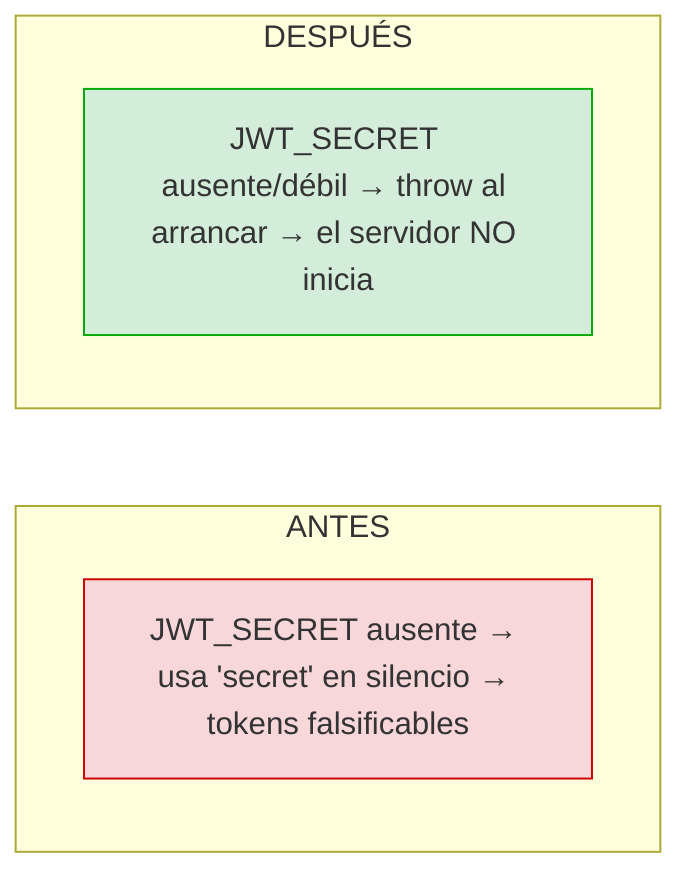
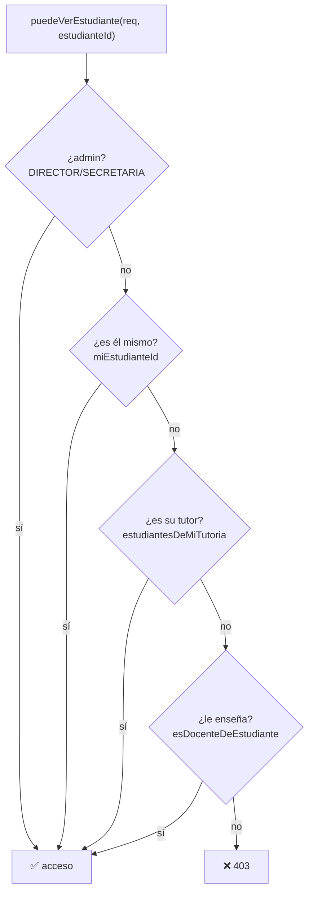
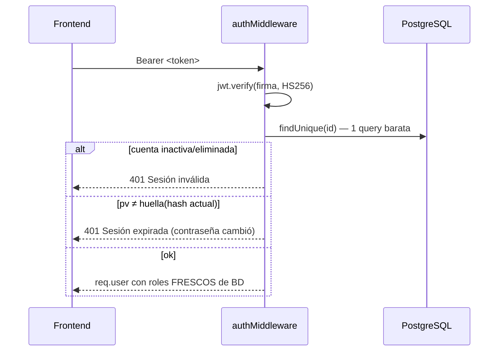
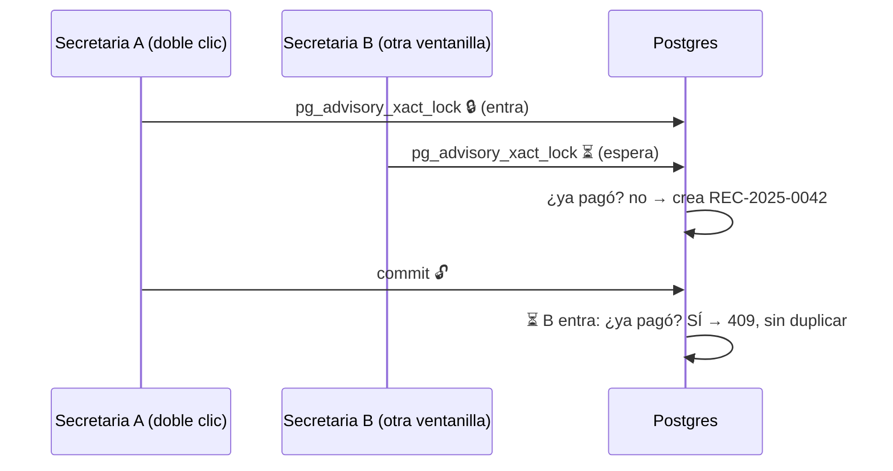
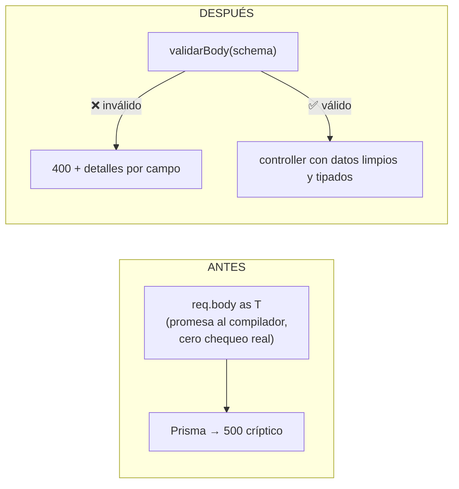

# Explicación de los cambios — Backend U.E. Los Ángeles

> Documento de estudio y defensa. No modifica código: explica **qué cambia cada archivo,
> qué bug corrige, cómo afecta al sistema y por qué se hizo así**.
> Leelo en orden: Cambios1 → Cambios2 → Cambios3 (es el orden en que deberían aplicarse).

---

## Mapa rápido: los 3 grupos

| Grupo | Tema | Idea en una frase |
|---|---|---|
| **Cambios1** (14 archivos) | Seguridad base + autorización | El servidor no arranca mal configurado, el login no bloquea a todo el curso, y una sola regla decide quién ve a quién |
| **Cambios2** (5 archivos) | Sesiones y dinero | Cambiar la contraseña cierra todas las sesiones al instante; dos cobros simultáneos no duplican recibos ni cobran doble |
| **Cambios3** (12 archivos) | Validación con zod | Los datos se validan **antes** de llegar al controlador, con mensajes en español; los errores 500 por datos malos pasan a ser 400 legibles |

```
cambios/
├── Cambios1/   app, auth.*, ownership, asistencia, boletin, calificacion,
│               estudiante, trimestre, config, .env.example, docker-compose,
│               package.json, tsconfig.build
├── Cambios2/   auth.* (copia idéntica a Cambios1), token.helper (NUEVO),
│               pago.controller, usuario.controller
└── Cambios3/   8 schemas zod (NUEVOS) + validate.middleware (NUEVO)
                + error.middleware + revisar-datos.sql
```

> ⚠️ **Aviso 1 — archivos repetidos:** `auth.controller.ts` y `auth.middleware.ts` aparecen
> **idénticos** en Cambios1 y Cambios2. Son el mismo cambio (el sistema de tokens con huella).
> Se explica una sola vez en §Cambios2. Al aplicar, copia uno solo.
>
> ⚠️ **Aviso 2 — archivos que faltan:** el `estudiante.controller.ts` nuevo importa
> `../lib/import.helper.js` (`ejecutarImport`, `mensajeValidacion`) y `../lib/errores.js`
> (`ErrorDeUsuario`), pero **esos dos archivos no están en la carpeta `cambios` ni en `src`**.
> Sin ellos el proyecto no compila. Hay que crearlos antes de copiar ese controller
> (ver §Orden de aplicación).
>
> ⚠️ **Aviso 3 — `usuario.controller.ts` de Cambios2 es 99% igual al actual:** el único delta
> real son 2 líneas en `resetearPassword` (limpia el bloqueo). El resto de la lógica
> (roles, secretaria, director único) ya está aplicada en tu `src/`.

---

## Cambios1 — Seguridad base + autorización única

### 1. `config.ts` — el servidor se niega a arrancar mal configurado

**Qué cambia:** el archivo actual está **vacío**. El nuevo lee `JWT_SECRET` una sola vez al
arrancar y lanza error si falta, es uno de los valores de ejemplo (`secret`, `changeme`,
`tu_secreto_jwt_aqui`) o mide menos de 32 caracteres.

**Qué bug corrige:** hoy el código hace `process.env.JWT_SECRET ?? 'secret'` en dos lugares
(`auth.middleware.ts`, `auth.controller.ts`). Si en el servidor se olvida el `.env`, la app
arranca igual firmando tokens con `"secret"` — cualquiera puede fabricar un token de DIRECTOR
sin contraseña. Es un fallo **silencioso**: nada avisa.

**Cómo afecta:** cambio de comportamiento en despliegue — con `.env` mal copiado el servidor
falla al iniciar con mensaje claro, en vez de funcionar inseguro. En desarrollo solo exige
generar un secreto real una vez (el `.env.example` nuevo trae el comando).

**Para explicar:** *"fail-fast: prefiero que el sistema no arranque a que arranque inseguro"*.



### 2. `app.ts` — tres arreglos de seguridad/red

| # | Cambio | Por qué |
|---|---|---|
| a | `import './lib/config.js'` en la línea 2 | Fuerza la validación del secreto **antes** de aceptar peticiones |
| b | `app.use('/api/auth/login', limiteLogin)` en vez del doble montaje | **Bug real que yo te había marcado:** hoy hay dos líneas `app.use('/api/auth', ...)`; la segunda monta las rutas sin límite y anula el rate-limit de login. Además el límite deja de cubrir `/me` y `/password` (un usuario legítimo navegando no debe gastar cuota de "anti-fuerza-bruta") |
| c | `skipSuccessfulRequests: true` en `limiteLogin` | En el colegio todos comparten la misma IP (wifi/NAT). Contando logins correctos, el estudiante nº 16 que entraba a primera hora quedaba bloqueado. Ahora solo cuentan los **fallidos**, que es lo que indica un ataque |
| d | `trust proxy` optativo vía `TRUST_PROXY` | Detrás de nginx/Render/Railway, Express ve la IP del proxy y el rate-limit trataría a todos como una sola IP. Se activa solo con variable explícita, porque activarlo sin proxy permitiría falsificar IP con `X-Forwarded-For` |

**Para explicar:** *"el rate-limit por IP y el bloqueo por cuenta son dos capas distintas:
el primero frena scraping/DoS básico, el segundo frena fuerza bruta contra una cuenta.
El `skipSuccessfulRequests` es un detalle de contexto real: un colegio = una IP"*.

### 3. `ownership.helper.ts` — la REGLA DE ORO del proyecto

**Qué cambia:** es el archivo con más fondo. Pasa de 3 funciones a un mini-sistema:

- **Nuevas funciones:** `perfilDocente / perfilEstudiante / perfilTutor` (privadas),
  `miEstudianteId()`, `estudiantesDeMiTutoria()`, `esDocenteDeEstudiante()` (privada),
  `puedeVerEstudiante()` (pública, la regla única).
- **La regla de oro** (documentada en el propio archivo): en Prisma un filtro con valor
  `undefined` **se ignora**. Entonces `findFirst({ where: { tutorId: tutor?.id, ... } })`
  cuando el usuario no tiene perfil de tutor se convierte en `findFirst({ where: {...} })`
  y devuelve el vínculo de **otro** tutor → acceso concedido por error. El nuevo código
  **siempre** comprueba que el perfil exista antes de consultar, y usa `select: { id: true }`
  (trae menos datos, más rápido).

**Qué bugs corrige (tres, todos de autorización):**

1. **Fuga por `undefined`** (el de arriba): tutor sin perfil, o docente sin perfil, podían
   pasar validaciones ajenas.
2. **Roles mezclados:** el viejo `esFamiliaDeEstudiante` hacía `return` temprano en la rama
   ESTUDIANTE; una cuenta con roles `ESTUDIANTE+TUTOR` (existe: `tut_elena` es TUTOR+DOCENTE)
   nunca llegaba a evaluarse como tutor. Ahora comprueba **ambos** caminos.
3. **Docente sin regla para fichas:** antes un docente solo podía validar "su asignación";
   no había forma de responder "¿este docente le enseña a este estudiante?". Nueva
   `esDocenteDeEstudiante()` (inscripción del estudiante en algún curso+gestión donde enseña)
   + `puedeVerEstudiante()` que lo combina todo.



**Cómo afecta:** todos los endpoints que reciben un `estudianteId` (ficha, notas, asistencia,
boletín, detalle) pasan a usar **una sola función**. La regla vive en un lugar; si cambia la
política (ej. permitir a preceptor), se cambia una vez.

### 4. `asistencia.controller.ts` — corrige una fuga de datos del tutor

**Qué cambia:** `getHistorial` se reescribe usando `puedeVerEstudiante()` + helpers nuevos;
`getReporteCurso` agrega `id` de materia y trimestre al `select`.

**Qué bug corrige (grave):** en el código actual, rama tutor:
```ts
where: { estudianteId: { in: estIds }, ...(estudianteId && { estudianteId: Number(estudianteId) }) }
```
la segunda clave **pisa** a la primera (mismo nombre de propiedad en el objeto). Un tutor
pasando `?estudianteId=X` de **cualquier** niño veía su asistencia. Ahora: con `?estudianteId`
se exige `puedeVerEstudiante`; sin él, el estudiante ve lo suyo y el tutor ve **todos** sus
tutorados (antes solo podía ver de a uno y con el bug).

**Mejora menor:** en `getReporteCurso` faltaban `materia.id` y `trimestre.id`; sin ellos el
frontend fundía los 3 trimestres en una sola columna.

### 5. `calificacion.controller.ts` — misma fuga, en notas

**Qué cambia:** `getCalificacionesEstudiante` reemplaza ~30 líneas de `if soloFamilia...`
por 3 pasos: resolver id (`estudianteId` o el propio vía `miEstudianteId`) → validar entero →
`puedeVerEstudiante()`.

**Qué bug corrige:** la rama tutor actual hace
`findFirst({ where: { tutorId: tutor?.id, ... } })` — si el usuario con rol TUTOR no tiene
perfil, `tutor?.id` es `undefined`, el filtro se ignora y **cualquier tutorado aparente pasa**.
Es exactamente la regla de oro de §3, en producción.

**Para explicar:** *"tres controllers tenían la misma validación copiada con variantes;
cada copia tenía su propio bug. La centralicé y los tres usan la misma"*.

### 6. `boletin.controller.ts` — cierra el círculo de autorización + 1 endpoint nuevo

| Endpoint | Cambio |
|---|---|
| `generarBoletin` (PDF trimestral) | `puedeVerEstudiante()` reemplaza chequeo manual que fallaba con roles mezclados y perfiles inexistentes |
| `generarLibreta` (PDF anual) | mismo cambio |
| `obtenerDetalleEstudiante` | **Bug:** solo contemplaba docente/familia, así que Director/Secretaria pasaban el `requireRol` de la ruta pero caían en **403 acá adentro**. Ahora admin pasa siempre |
| `obtenerDetallePorEstudiante` | **Nuevo:** mismo detalle pero por `estudianteId+gestionId`, para cuando el frontend solo tiene el id del estudiante (buscador) y no el `inscripcionId`. Reutiliza la misma regla de acceso |

**Cómo afecta:** ningún cambio visual en PDFs; todo es quién puede pedirlos. El nuevo endpoint
evita que el frontend tenga que resolver la inscripción por su cuenta.

### 7. `estudiante.controller.ts` — autorización + import masivo robusto

- `getEstudianteById`: reemplaza ~20 líneas de lógica `soloFamilia` (que dejaba pasar a
  docentes y roles mezclados) por `puedeVerEstudiante()`.
- `getEstudiantes`: corrige filtro `estado` → `estadoInscripcion` (nombre real del campo;
  antes filtraba por un campo inexistente) e incluye `usuario` para que el frontend sepa si
  ya tiene cuenta (antes "Vincular cuenta" salía siempre).
- `importEstudiantes` (Excel): se reescribe sobre los schemas de Cambios3 + `ejecutarImport`:
  valida cada fila con las **mismas reglas que la API**, detecta CI duplicados dentro del
  archivo y precarga los CI existentes en **una sola consulta** (antes: una por fila).
- Requiere `lib/import.helper.js` y `lib/errores.js` → **ver Aviso 2**: no vienen en `cambios`.

### 8. `trimestre.controller.ts` — un 500 convertido en 400

**Qué cambia:** `createTrimestre` exige `fechaInicio` y `fechaFin` con 400 claro.
**Por qué:** son obligatorias en BD; omitirlas llegaba a Prisma y volvía como 500.
Mejora pequeña pero es el ejemplo perfecto de la filosofía de Cambios3: validar en el borde.

### 9. Infraestructura (`.env.example`, `docker-compose.yml`, `package.json`, `tsconfig.build.json`)

| Archivo | Cambio | Por qué |
|---|---|---|
| `.env.example` | Documenta `JWT_SECRET` (32+ chars + comando para generarlo), `POSTGRES_PASSWORD`, `TRUST_PROXY` | El ejemplo anterior traía `JWT_SECRET="tu_secreto..."` que el nuevo `config.ts` rechaza a propósito |
| `docker-compose.yml` | Password por `${POSTGRES_PASSWORD:?...}` (falla con mensaje si falta) + puerto bindeado a `127.0.0.1` | Antes la contraseña estaba hardcodeada y Postgres quedaba expuesto a toda la red local |
| `package.json` | Agrega `zod`, corrige `start` a `node dist/src/server.js` | `zod` se importaba sin estar instalado (hoy rompería el build al usarse); el `start` viejo apuntaba a una ruta que ya no existe con el nuevo `rootDir` |
| `tsconfig.build.json` | `rootDir: "."` + `include` de `prisma/generated` | Con `rootDir: ./src`, TypeScript rechaza importar archivos fuera de `src` (el cliente Prisma generado vive en `prisma/generated`). Sin esto, `tsc` no compila el proyecto real |

---

## Cambios2 — Sesiones que se invalidan al instante + pagos a prueba de doble clic

### 10. `token.helper.ts` — NUEVO, el corazón del grupo

**Qué es:** dos funciones en un solo lugar:

- `huellaPassword(hash)` = `HMAC_SHA256(JWT_SECRET, passwordHash).slice(0,16)` — una huella
  de la contraseña vigente. Se usa HMAC (no el hash directo) para **no exponer el hash**
  dentro del token.
- `firmarToken({...})` — emite el JWT con el campo extra `pv` (password version).

**Por qué así y no con una columna `tokenVersion`:** no requiere **migración de BD**.
La huella cambia sola cuando cambia el hash. Decisión explícita documentada en el archivo —
buen punto para defender: *"evalué alternativa con migración y elegí la sin migración"*.

### 11. `auth.middleware.ts` + `auth.controller.ts` — revalidación por request

**Antes:** el middleware solo verificaba la firma. Los `roles` se creían del token por 8 h:
desactivar una cuenta, cambiar roles o resetear contraseña **no surtía efecto hasta que el
token vencía**.

**Después:** además de la firma (fijando algoritmo `HS256`), hace un `findUnique` por clave
primaria (barato) y:

1. cuenta eliminada o `activo=false` → 401 al instante;
2. `payload.pv !== huellaPassword(hash actual)` → 401 (contraseña cambiada/resetada invalida
   **todos** los tokens viejos);
3. `req.user.roles` se toma de la **BD**, no del token (cambio de roles inmediato).

Detalles finos: tokens de antes de esta versión (sin `pv`) se rechazan una vez → logout único;
si la BD falla devuelve **500, no 401** (el token es válido, el problema es del servidor —
distinguirlos evita cerrar sesiones por un microcorte de red). `cambiarPassword` devuelve un
token nuevo para no desloguear al usuario que acaba de cambiar su clave.



**Costo honesto (si te preguntan):** +1 query por request autenticado. Es por PK, despreciable
frente a cualquier query de negocio, y es el precio de la invalidación inmediata.

### 12. `pago.controller.ts` — dinero serio: transacción + candado + recibos sin huecos

Es el cambio más "de ingeniería" del lote. Tres problemas reales:

**a) Condición de carrera (doble cobro / recibo duplicado).** Antes: (1) comprobar duplicado →
(2) `count()+1` para el recibo → (3) crear. Entre pasos se colaba otro cobro: mismo concepto
cobrado dos veces, o dos recibos con el mismo número (el segundo fallaba con 500 por el
`unique`). Ahora todo va en `prisma.$transaction` bajo `pg_advisory_xact_lock()` — un candado
de Postgres que hace que los cobros se procesen **de a uno**. Comprobación, numeración y
creación son un paso indivisible.

**b) Numeración frágil.** `count()+1` se descuadra si hay anulados o huecos, y pasado
`REC-2025-9999` ordenaba mal como texto. Ahora: `MAX(número)+1` del año, comparado como
**entero** vía SQL.

**c) Validación de negocio que faltaba:** concepto inactivo, concepto de otra gestión que la
inscripción, descuento mayor al monto, montos como texto (`"100.50"` aceptado, `"abc"`/`NaN`/
`Infinity` rechazados vía `aDinero`), observaciones limitadas a 500.

**d) `anularPago` atómico y con auditoría:** antes pisaba `observaciones` con `"ANULADO: ..."`.
Ahora **antepone** quién y cuándo (`ANULADO por <usuario> el <fecha>: <motivo>`) conservando la
nota original, y usa `updateMany({ where: { estado: { not: 'ANULADO' } } })` — si dos personas
anulan a la vez, solo una gana (`count===0` → "ya está anulado").



### 13. `usuario.controller.ts` — delta mínimo (2 líneas)

El archivo de Cambios2 solo agrega a `resetearPassword`:
`{ passwordHash, intentosFallidos: 0, bloqueadoHasta: null }`.
**Por qué:** si el usuario estaba bloqueado por intentos fallidos, resetearle la clave sin
desbloquearlo lo dejaba sin poder entrar con la clave nueva. El resto del archivo ya coincide
con tu `src/` actual — al aplicar, basta portar ese hunk.

---

## Cambios3 — Validación con zod: del `as` a la garantía

### La idea central (para explicarla en 30 segundos)

Hoy cada controller hace `req.body as { monto?: number }`. Ese `as` **no comprueba nada en
ejecución**: `"monto": "abc"`, un id negativo o `"2026-02-31"` viajan hasta Prisma y vuelven
como **500**. Con zod el cuerpo se valida **antes** del controller; si falla → **400** con
`{ error, detalles }`; si pasa → el controller recibe datos ya convertidos (números como
número, textos recortados, campos desconocidos eliminados). Y el tipo TypeScript **sale del
schema**: validación y tipos no se desincronizan nunca.



### 14. `common.schema.ts` — las piezas (leer primero)

Base de todo: `id` (entero positivo ≤ INT4 de Postgres), `entero/decimal` con rangos,
`numeroFlexible` (acepta `5` y `"5"` — los formularios web mandan texto — pero rechaza
`"abc"/NaN/Infinity/booleanos`; `""` cuenta como "no enviado" para no confundir un `<select>`
vacío), `texto/textoReq/textoOpc` (en opcionales `""` se respeta para poder **vaciar** un campo
al editar), `fecha` que **verifica el calendario a mano** (porque `Date.parse("2026-02-31")`
no falla: lo convierte al 3 de marzo), `hora` HH:mm, `ci/teléfono/email/username` con reglas
reales, `passwordNueva` (mínimo + **máximo 72**: bcrypt ignora lo que exceda, más largo no
aporta seguridad — detalle que muestra dominio), mensajes en español con `"es obligatorio"`
cuando el campo no viene. Criterio de compatibilidad: campos desconocidos se **descartan**,
no se rechazan, para no romper el frontend existente.

### 15. `validate.middleware.ts` — NUEVO, el pegamento

- `validarBody(schema)`: `safeParse(req.body ?? {})` (el `?? {}` es por Express 5, donde
  `body` puede ser `undefined`). Error → 400 con frase legible + `detalles` por campo (el
  frontend puede marcar cada input). Éxito → `req.body` reemplazado por el dato convertido.
  Se coloca **después** de `requireRol`: sin permiso → 403 antes que 400 (no filtrar info de
  validación a quien no debe).
- `paramEntero`: para `router.param('id', ...)` — rechaza `"abc"`, `"-1"`, `"1e9"` con 400 en
  vez de dejar que un `NaN` termine en 500 de BD.

### 16. `error.middleware.ts` — la red de abajo

Agrega al actual: `ErrorDeUsuario` (errores con mensaje pensado para mostrar, con su status),
`ZodError` escapado de un controller (400, no 500), JSON malformado (`entity.parse.failed` →
400 en vez de 500) y cuerpo gigante (413). Mantiene lo de multer/xlsx.

### 17. Schemas por dominio (8 archivos)

| Archivo | Qué valida | Detalle que demuestra criterio |
|---|---|---|
| `auth.schema.ts` | login, cambio de password | La password de **login** no se recorta ni se limita: solo debe existir (recortarla impediría entrar a quien la registró con espacios) |
| `usuario.schema.ts` | crear/actualizar/resetear/vincular/con-perfil | `roles` sin repetidos (Set), update exige al menos un campo, vincular exige al menos un perfil |
| `persona.schema.ts` | persona base + estudiante/docente/tutor/director/secretaria | `parentesco` normaliza `"madre"` → `"MADRE"` (el Excel/frontend mandan minúsculas); edición = todo parcial |
| `academico.schema.ts` | gestión/trimestre/curso/materia/institución | `fechaFin > fechaInicio` como invariante; `nivel` de curso **no editable** (rompería el historial); trimestre fijo 1–3 |
| `evaluacion.schema.ts` | dimensiones/actividades/notas/asistencia | Topes = límites reales de columna (`Decimal(5,2)` → 999.99); **peso como fracción** (0.45, no 45: el entero desborda `Decimal(4,3)`); lotes sin repetidos y máx 300; el tope nota ≤ puntajeMaximo queda en el controller (depende de BD, no del schema) |
| `horario.schema.ts` | crear/editar horario | `horaFin > horaInicio` comparando texto HH:mm (orden lexicográfico = cronológico); antes `"25:99"` daba `Invalid Date` → 500 |
| `inscripcion.schema.ts` | inscribir/resultado/cambio de estado | Enums exactos del schema Prisma |
| `pago.schema.ts` | concepto/registro/anulación | Dinero acotado a `Decimal(10,2)` (99 999 999.99) |

### 18. `revisar-datos.sql` — el puente con los datos viejos

**Qué es:** 4 SELECTs de solo lectura que listan Personas con CI/teléfono/email/nombre que
**no pasarían** las nuevas reglas. **Por qué importa:** endurecer la validación puede hacer que
una ficha vieja no se pueda ni re-guardar (el 400 la rechaza hasta corregirla). Se corre
**antes** de desplegar para limpiar datos. Menciónalo en defensa: *"validar más estricto
sin auditar datos existentes es romper edición de fichas viejas"*.

---

## Orden de aplicación sugerido (con dependencias)

```
1. config.ts + .env.example  (base: JWT_SECRET real de 32+ chars, POSTGRES_PASSWORD)
2. token.helper.ts (Cambios2) + auth.middleware + auth.controller
   → ⚠️ primera vez invalida todos los tokens viejos (logout único general, avisarlo)
3. ownership.helper + asistencia + calificacion + boletin + estudiante
   → ⚠️ crear ANTES lib/errores.js y lib/import.helper.js (faltan en cambios)
4. pago.controller + hunk de usuario.controller (reset desbloquea)
5. trimestre.controller (independiente, puede ir en cualquier momento)
6. package.json (pnpm install: entra zod) + tsconfig.build + app.ts + docker-compose
   → ⚠️ coordinar con frontend el cambio de start (dist/src/...)
7. Schemas (common → resto) + validate.middleware + error.middleware,
   cablear validarBody en rutas + router.param('id', paramEntero)
8. Correr revisar-datos.sql en BD real y limpiar antes de activar validación estricta
```

## Preguntas probables del tribunal (respuestas de 2 líneas)

- **¿Por qué revalidar el usuario en cada request y no confiar en el token?**
  Porque desactivar, cambiar roles o resetear contraseña debe surtir efecto ya, no en 8 h.
  Cuesta 1 query por PK, despreciable.
- **¿Por qué HMAC y no guardar el hash en el token?** Para no exponer el hash; la huella
  cambia sola al cambiar la contraseña, sin migración de BD.
- **¿Por qué el candado en pagos y no solo `unique`?** El `unique` evita el duplicado pero
  devuelve 500 al segundo cobro y no evita el doble cobro por doble clic; el candado
  serializa comprobación+numeración+creación como un paso.
- **¿Por qué `skipSuccessfulRequests`?** Porque el colegio comparte IP; sin eso, 16 logins
  legítimos bloqueaban a todo el curso.
- **¿Por qué zod en vez de `if`s?** Un `as` no valida nada en ejecución; el schema valida,
  convierte y tipa desde una sola definición, con mensajes en español por campo.
- **¿Qué pasa con los datos viejos que no cumplen?** Se auditan con `revisar-datos.sql`
  antes de desplegar; si no, fichas viejas dejan de poder guardarse.
